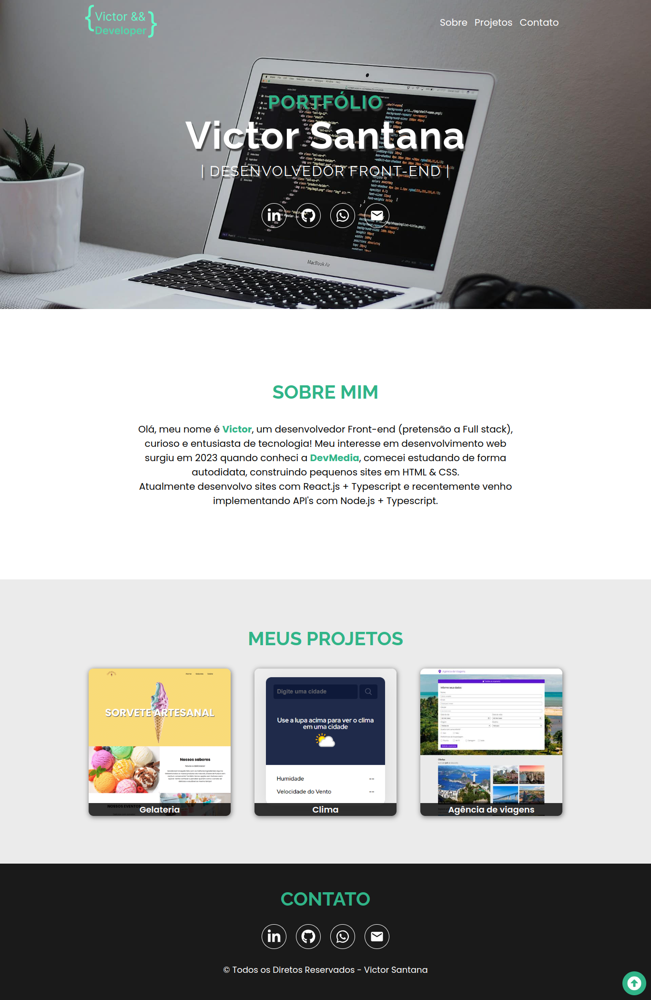

<h1 align="center"> Portfólio - Victor Santana </h1>

 

  <a href="#-tecnologias">Tecnologias</a>&nbsp;&nbsp;&nbsp;|&nbsp;&nbsp;&nbsp;
  <a href="#-projeto">Projeto</a>

 

  

## 🚀 Tecnologias

Esse projeto foi desenvolvido com as seguintes tecnologias:

- React.js
- Typescript
- Git e Github

## 💻 Projeto

Este é o projeto do meu portfólio.

- [Acesse o projeto finalizado, online](https://portfolio-six-iota-72.vercel.app/)
